# GeneralWebApi

A modern enterprise management system built with .NET 9 and Angular, featuring employee management, organizational structure, contract management, and role-based access control.

##  Technology Stack

### Backend
- **.NET 9.0** - Latest .NET framework
- **ASP.NET Core Web API** - RESTful API framework
- **Entity Framework Core 9.0.7** - ORM for database operations
- **SQL Server** - Primary database
- **Redis** - Distributed caching
- **JWT Authentication** - Secure token-based authentication

### Frontend
- **Angular 19** - Modern web framework
- **NgRx** - State management
- **PrimeNG** - UI component library
- **Angular Material** - Material Design components
- **SCSS** - Styling with theme support

##  Key Features

-  **Employee Management** - Comprehensive employee data management
-  **Department & Position Management** - Organizational structure management
-  **Contract Management** - Contract lifecycle and approval workflows
-  **Role-Based Access Control** - Granular permission management
-  **Theme Support** - Light and dark mode
-  **Responsive Design** - Mobile-friendly interface
-  **Multi-language Support** - Internationalization ready
-  **Dashboard & Analytics** - System monitoring and insights

## Project Preview

### Dashboard


### Employee Management

#### Employee List View
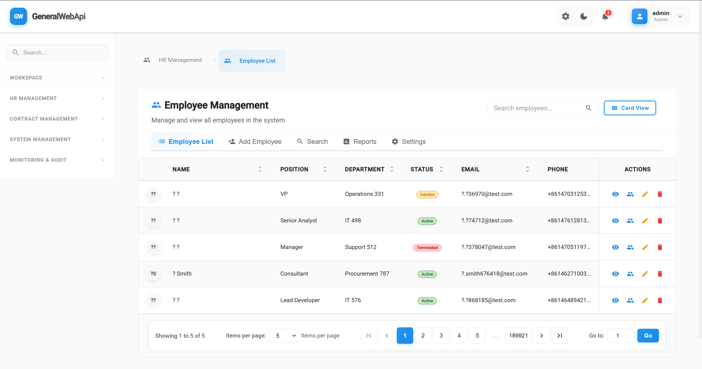

#### Employee Card View
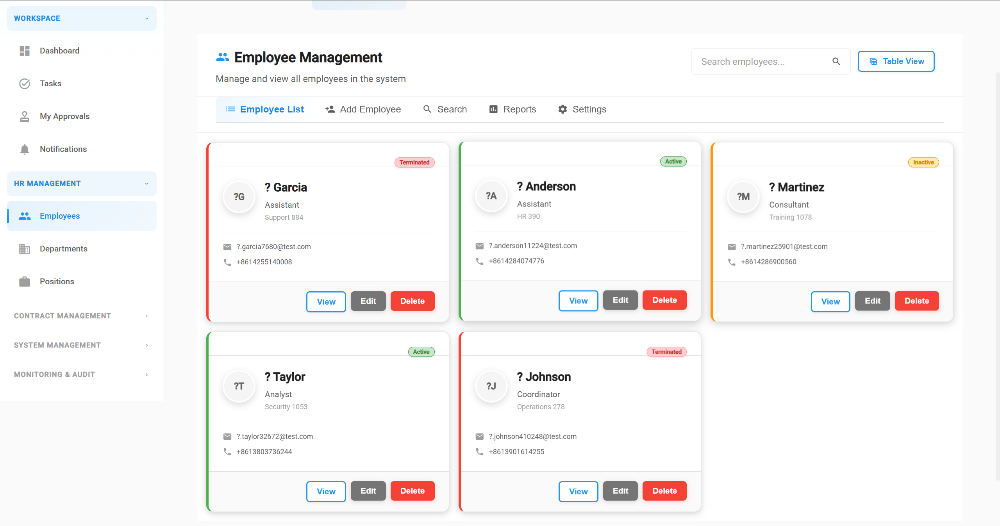

#### Employee Detail
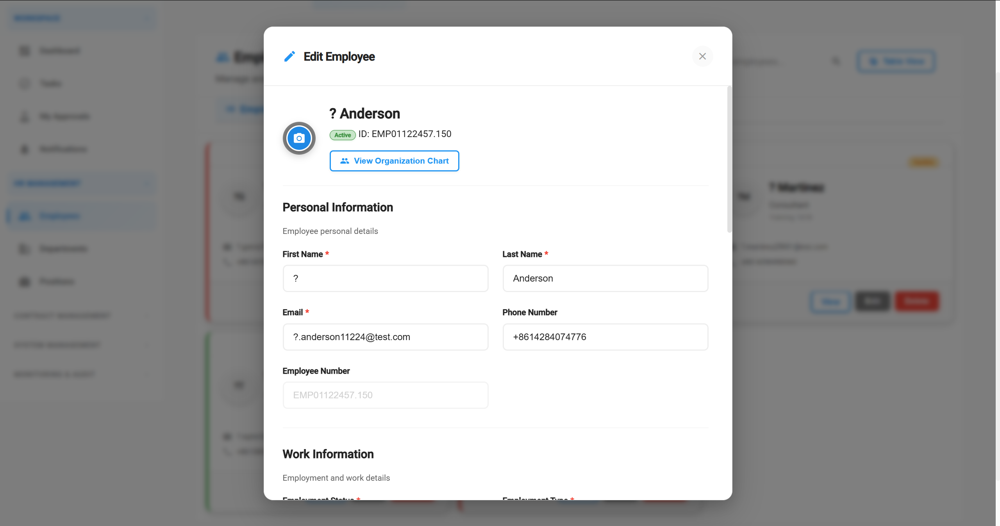

#### Adding Employee
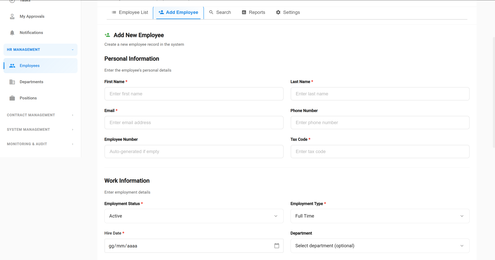

### Department Management

#### Department Management


#### Department Search
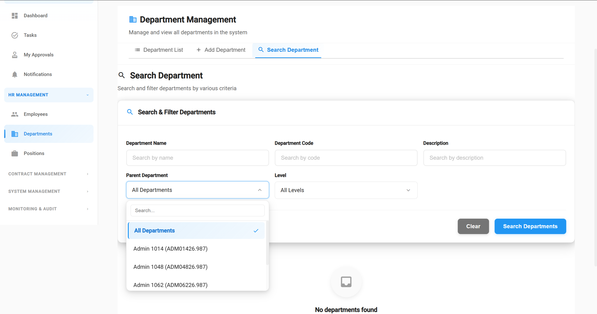

### Contract Management

#### Contract Templates
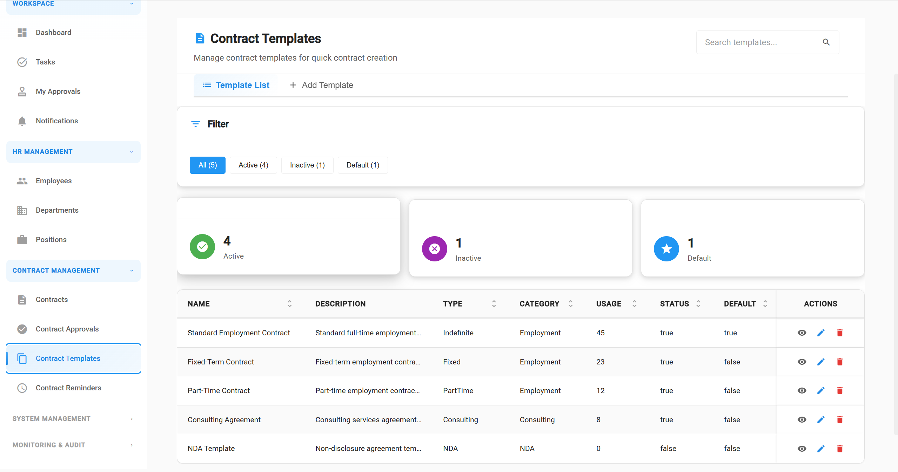

#### Contract Approval Detail
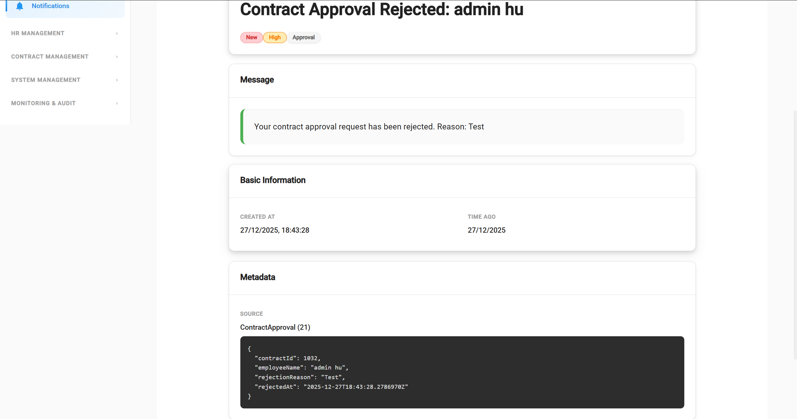

#### Approval Steps
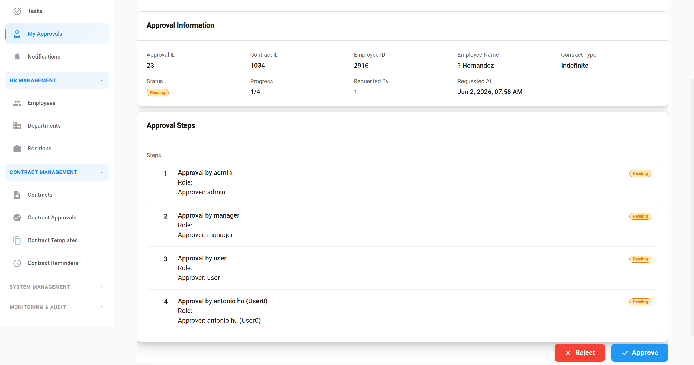

### Approval Management
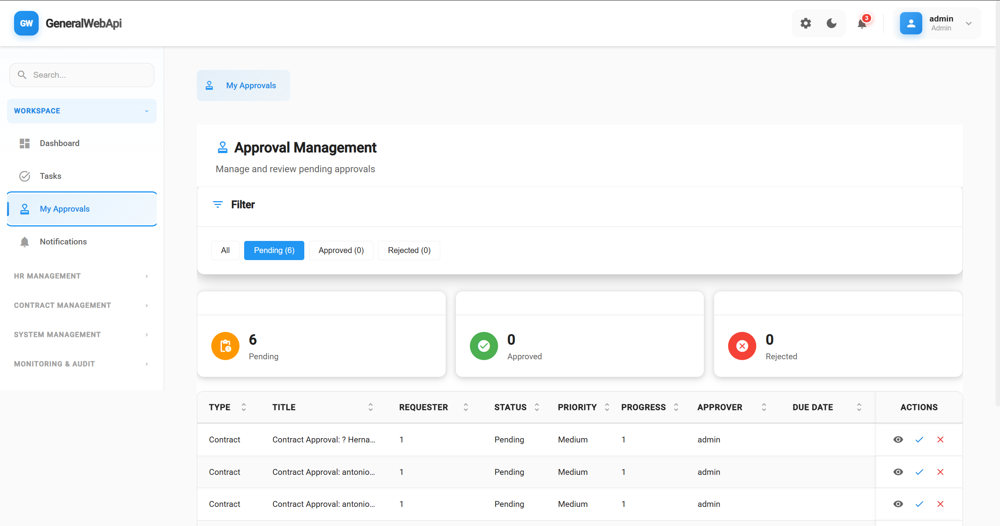

### Mobile Views

#### Mobile Example
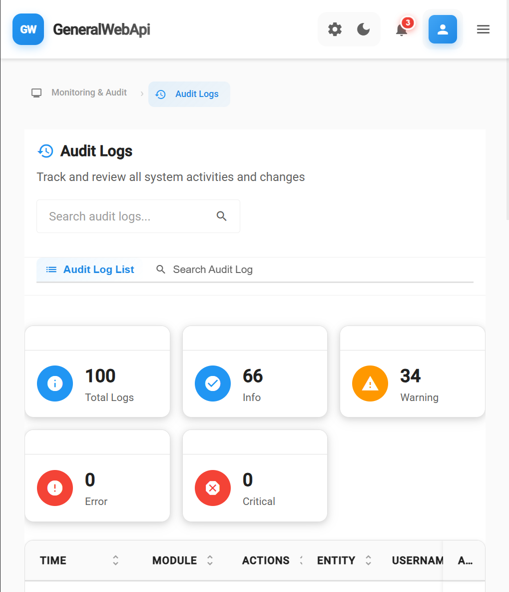

#### Mobile Sidebar
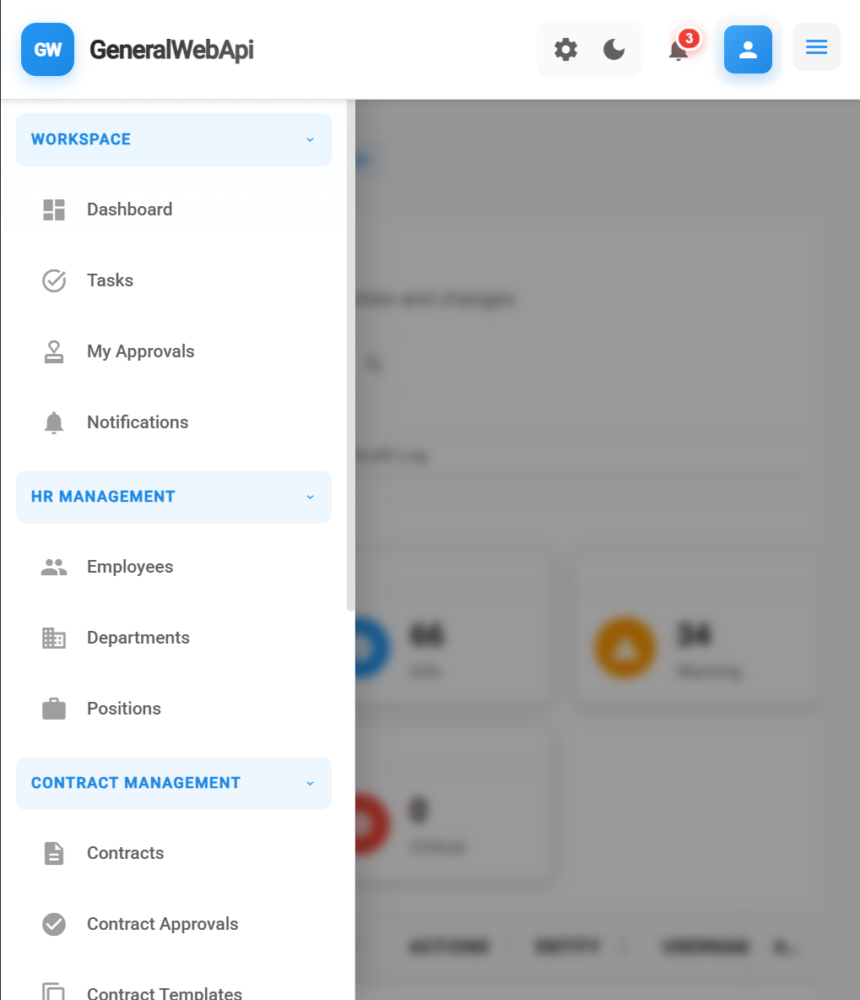

### System Features

#### Settings


#### System Security
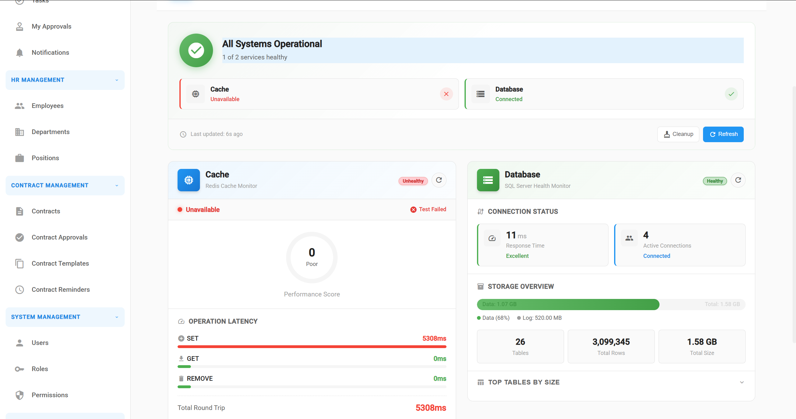

#### Audit Logs


#### Authentication


#### Notifications
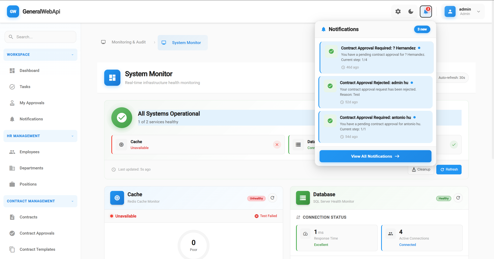

### User Features

#### User Modal


#### Reset Password


### UI Components

#### Loading Spinner
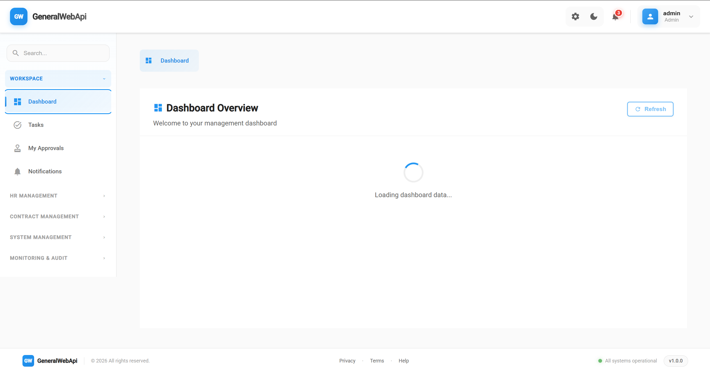

#### Todo List
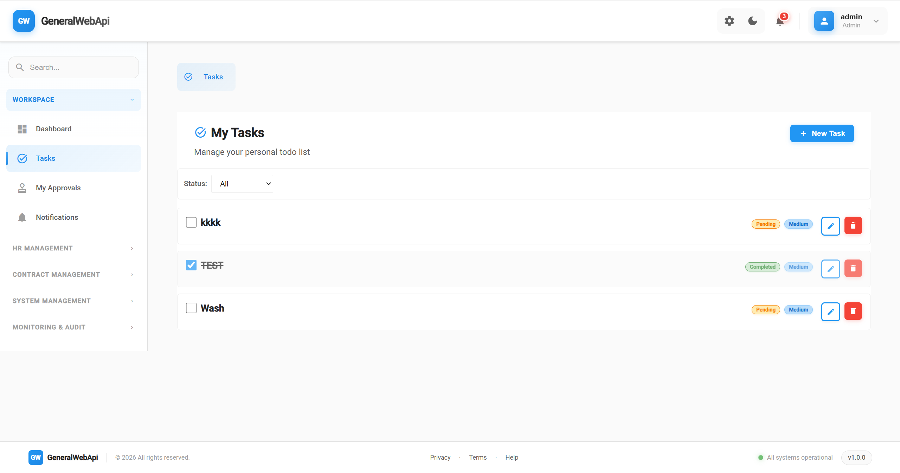

### Backend API Examples


## Quick Start

### Prerequisites
- .NET 9.0 SDK
- Node.js 18+ and npm
- SQL Server
- Redis (optional, for caching)

### Using Docker Compose

```bash
# Start all services
docker-compose up

# Run in background
docker-compose up -d
```

### Manual Setup

#### Backend
```bash
cd GeneralWebApi/Backend
dotnet restore
dotnet run
```

#### Frontend
```bash
cd GeneralWebApi/Frontend/general-frontend
npm install
ng serve
```

## 📁 Project Structure

```
GeneralWebApi/
├── Backend/              # .NET Web API
│   ├── src/
│   │   ├── 1-Presentation/    # API controllers
│   │   ├── 2-Application/     # Business logic
│   │   ├── 3-Domain/          # Domain models
│   │   ├── 4-Infrastructure/  # Data access & services
│   │   └── 5-Shared/          # Shared utilities
│   └── docs/                  # Backend documentation
├── Frontend/            # Angular application
│   └── general-frontend/
│       ├── src/
│       │   ├── app/           # Application code
│       │   ├── assets/        # Static assets
│       │   └── styles/        # Global styles
│       └── docs/              # Frontend documentation
├── Preview/             # Project screenshots
└── docker-compose.yml   # Docker configuration
```

##  Documentation

- [Backend Documentation](./GeneralWebApi/Backend/README.md)
- [Frontend Documentation](./GeneralWebApi/Frontend/README.md)
- [API Documentation](./GeneralWebApi/Backend/docs/API_Documentation.md)
- [Deployment Guide](./GeneralWebApi/Backend/docs/Deployment_Guide.md)

## 🔧 Development

### Backend Development
- Clean Architecture pattern
- Domain-Driven Design (DDD)
- CQRS implementation
- Repository pattern

### Frontend Development
- Component-based architecture
- NgRx state management
- SCSS with design tokens
- Theme system with CSS variables

##  License

This project is proprietary software.

##  Contributing

This is an internal personal project.

---

**Built with  using .NET 9 and Angular 19**